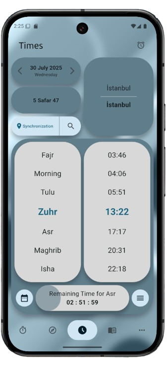

# Prayer Times App (Namaz Vakti App)

[](https://opensource.org/licenses/Apache-2.0)
[](https://flutter.dev)
[](https://github.com/afaruk59/Namaz-Vakti-App)

A comprehensive Islamic prayer companion app built with Flutter, providing accurate prayer times, Qibla direction, dhikr counter, and access to Islamic literature.

## 📸 Screenshots

<div align="center">
  <table>
    <tr>
      <td align="center">
        
      </td>
      <td align="center">
        
      </td>
      <td align="center">
        
      </td>
    </tr>
    <tr>
      <td align="center">
        
      </td>
      <td align="center">
        
      </td>
    </tr>
  </table>
</div>

## 📱 Features

### 🕌 Core Religious Features

- **Accurate Prayer Times**: Location-based prayer time calculations with automatic updates
- **Qibla Compass**: Precise direction to Mecca with compass calibration support
- **Dhikr Counter**: Digital tasbih for religious recitations with customizable profiles
- **Islamic Books**: Extensive collection of religious texts with audio playback support
- **Prayer Notifications**: Customizable prayer time reminders with Adhan sounds

### 📅 Calendar & Scheduling

- **Holy Days Calendar**: Islamic calendar with important religious dates
- **Calendar Integration**: Add prayer times directly to your device calendar
- **Missed Prayers Tracker**: Keep track of Qaza (missed) prayers
- **Prayer Time Alarms**: Individual alarm settings for each prayer time

### 🎨 Customization & Settings

- **Multi-language Support**: Available in 9 languages (English, Arabic, Turkish, German, Spanish, French, Italian, Russian)
- **Theme Customization**: Dark/light mode with customizable color schemes
- **Flexible Layout Options**: Rounded or sharp design elements
- **Location Services**: Automatic location detection or manual city selection

### 📱 Platform Features

- **Android Widget**: Home screen widget displaying current prayer times
- **Background Services**: Persistent notifications and prayer time updates
- **Audio Support**: Built-in audio player for Islamic content and Adhan
- **Offline Functionality**: Core features work without internet connection

## 🚀 Getting Started

### Prerequisites

- Flutter SDK 3.4.4 or higher
- Dart SDK
- Android Studio / Xcode (for device deployment)

### Installation

1. **Clone the repository**

   ```bash
   git clone https://github.com/afaruk59/Namaz-Vakti-App.git
   cd Namaz-Vakti-App
   ```

2. **Install dependencies**

   ```bash
   flutter pub get
   ```

3. **Run the app**
   ```bash
   flutter run
   ```

### Building for Production

#### Android

```bash
flutter build apk --release
# or for App Bundle
flutter build appbundle --release
```

#### iOS

```bash
flutter build ios --release
```

## 🏗️ Project Structure

```
lib/
├── books/                  # Islamic books module
│   ├── features/          # Book reading features
│   ├── screens/           # Book-related screens
│   └── shared/            # Shared book components
├── components/            # Reusable UI components
├── data/                  # Data models and services
├── l10n/                  # Localization files
├── pages/                 # Main app screens
│   ├── timesPage/        # Prayer times functionality
│   └── [other pages]     # Various app screens
└── main.dart             # App entry point
```

## 🌐 Supported Languages

- 🇺🇸 English
- 🇸🇦 Arabic (العربية)
- 🇹🇷 Turkish (Türkçe)
- 🇩🇪 German (Deutsch)
- 🇪🇸 Spanish (Español)
- 🇫🇷 French (Français)
- 🇮🇹 Italian (Italiano)
- 🇷🇺 Russian (Русский)

## 📋 Permissions

The app requires the following permissions:

### Android

#### Location & Network

- **ACCESS_FINE_LOCATION**: Precise location for accurate prayer time calculations
- **ACCESS_COARSE_LOCATION**: Approximate location as fallback
- **INTERNET**: Network access for fetching prayer times and content
- **ACCESS_NETWORK_STATE**: Monitor network connectivity status
- **ACCESS_WIFI_STATE**: Check Wi-Fi connection status
- **CHANGE_WIFI_STATE**: Manage Wi-Fi connections for data sync

#### Notifications & Alerts

- **POST_NOTIFICATIONS**: Display prayer time notifications (Android 13+)
- **USE_FULL_SCREEN_INTENT**: Show full-screen prayer time alerts
- **VIBRATE**: Vibration feedback for notifications and alerts
- **WAKE_LOCK**: Keep device awake for reliable notifications
- **RECEIVE_BOOT_COMPLETED**: Restart notification services after device reboot

#### Background Services

- **FOREGROUND_SERVICE**: Run persistent prayer time service
- **FOREGROUND_SERVICE_SPECIAL_USE**: Religious prayer timing service
- **FOREGROUND_SERVICE_MEDIA_PLAYBACK**: Audio playback for Adhan and books
- **REQUEST_IGNORE_BATTERY_OPTIMIZATIONS**: Bypass battery optimization for reliable notifications

#### Calendar Integration

- **READ_CALENDAR**: Access device calendars for integration
- **WRITE_CALENDAR**: Add prayer times and Islamic events to calendar

## 🛠️ Dependencies

### Core Dependencies

- `flutter`: Flutter SDK
- `provider`: State management
- `shared_preferences`: Local data storage
- `http`: Network requests
- `intl`: Internationalization

### UI & Experience

- `google_fonts`: Custom fonts
- `flutter_svg`: SVG support
- `photo_view`: Image viewing
- `page_flip_builder`: Book page animations

### Device Integration

- `geolocator`: Location services
- `flutter_compass`: Compass functionality
- `device_calendar`: Calendar integration
- `vibration`: Haptic feedback
- `permission_handler`: Permission management

### Audio & Media

- `just_audio`: Audio playback
- `audioplayers`: Sound effects
- `cached_network_image`: Image caching

## 🎯 Key Features Explained

### Prayer Times Calculation

The app uses precise astronomical calculations combined with location data to provide accurate prayer times. Times are fetched from Namazvakti.com API and adjusted for local conditions.

### Qibla Direction

Uses device compass and GPS coordinates to calculate the precise direction to the Kaaba in Mecca. Includes calibration instructions for improved accuracy.

### Islamic Books Library

Features a comprehensive collection of Islamic literature including:

- Seâdet-i Ebediyye (Endless Bliss)
- Mektûbat Tercemesi
- İslâm Ahlâkı
- And many more classical Islamic texts

### Notification System

Advanced notification system with:

- Individual prayer time alarms
- Customizable notification sounds
- Adhan playback options
- Background service for reliability

## 🔧 Configuration

### First Time Setup

1. Grant location permissions for accurate prayer times
2. Select your preferred language
3. Choose theme and layout preferences
4. Configure notification settings
5. Set up prayer time alarms

### Advanced Settings

- **Location Mode**: Choose between automatic GPS or manual city selection
- **Calculation Method**: Various prayer time calculation methods
- **Theme Options**: Customize colors and layout style
- **Sound Settings**: Configure Adhan and notification sounds

## 🤝 Contributing

Contributions are welcome! Please feel free to submit a Pull Request. For major changes, please open an issue first to discuss what you would like to change.

### Development Guidelines

1. Follow Flutter development best practices
2. Maintain consistent code formatting
3. Add appropriate comments for complex logic
4. Update documentation when adding new features
5. Test on both Android and iOS platforms

## 📄 License

This project is licensed under the Apache License 2.0 - see the [LICENSE](LICENSE) file for details.

```
Copyright [2024-2025] [Afaruk59]

Licensed under the Apache License, Version 2.0 (the "License");
you may not use this file except in compliance with the License.
You may obtain a copy of the License at

    http://www.apache.org/licenses/LICENSE-2.0

Unless required by applicable law or agreed to in writing, software
distributed under the License is distributed on an "AS IS" BASIS,
WITHOUT WARRANTIES OR CONDITIONS OF ANY KIND, either express or implied.
See the License for the specific language governing permissions and
limitations under the License.
```

## 🙏 Acknowledgments

- Prayer times data provided by [Namazvakti.com](https://namazvakti.com)
- Islamic texts and literature from classical sources
- Flutter community for excellent packages and support
- Contributors and users for feedback and suggestions

## 📞 Support

For support, bug reports, or feature requests:

- Create an issue on GitHub
- Contact the developer through the app's about section

---

**Made with ❤️ for the Muslim community**
