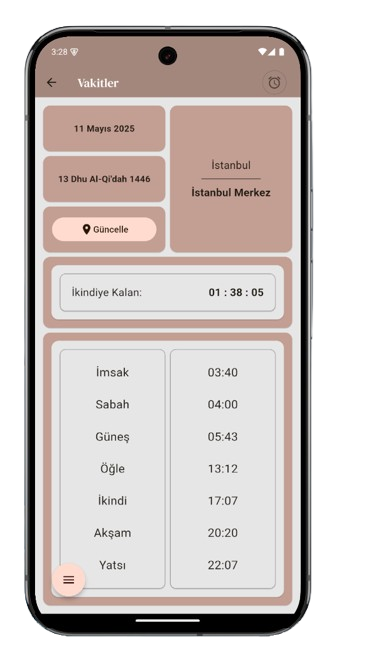
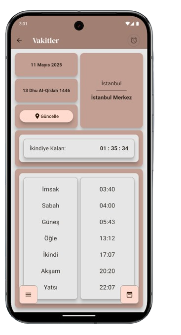
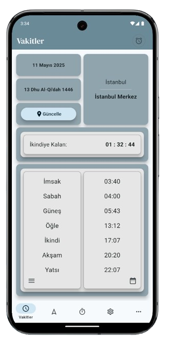
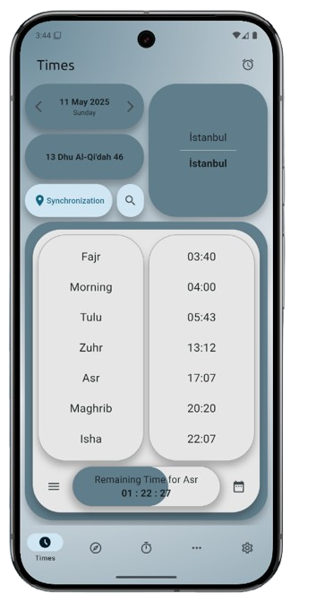

# 🕌 Namaz Vakti Uygulaması

[](https://flutter.dev)
[](https://dart.dev)
[](https://developer.android.com)
[](https://opensource.org/licenses/Apache-2.0)

> **Tüm Müslümanlar için tasarlanmış kapsamlı bir namaz vakitleri ve İslami özellikler uygulaması**

## 📱 Uygulama Hakkında

Namaz Vakti Uygulaması, günlük ibadet hayatınızı kolaylaştırmak için tasarlanmış modern ve kullanıcı dostu bir mobil uygulamadır. Konum tabanlı namaz vakitleri, kıble pusulası, zikir sayacı ve daha birçok İslami özellik ile dini yaşamınızı destekler.

## ✨ Özellikler

### 🕐 Namaz Vakitleri
- **Otomatik Konum Tespiti**: GPS ile otomatik konum belirleme
- **Tüm Vakit Bilgileri**: İmsak, Güneş, Öğle, İkindi, Akşam, Yatsı ve Tulu vakitleri
- **Çoklu Şehir Desteği**: Türkiye ve dünya şehirlerinin namaz vakitleri
- **Hassas Hesaplama**: Coğrafi konuma göre hassas vakit hesaplamaları

### 🧭 Kıble Pusulası
- **Dijital Pusula**: Kıble yönünü gösteren hassas dijital pusula
- **Konum Tabanlı**: Mevcut konumunuza göre otomatik kıble yönü hesaplama
- **Görsel Gösterge**: Kolay kullanımlı görsel arayüz

### 📿 Zikir Sayacı
- **Dijital Tespihat**: Dokunmatik zikir sayma özelliği
- **Kayıt Sistemi**: Zikir sayılarınızı kaydetme ve takip etme
- **Çoklu Zikir Desteği**: Farklı zikir türleri için ayrı sayaçlar

### 🔔 Namaz Bildirimleri
- **Vakit Bildirimleri**: Tüm namaz vakitleri için bildirim seçenekleri
- **Özelleştirilebilir**: Hangi vakitler için bildirim alacağınızı seçme
- **Sesli Bildirimler**: Farklı bildirim sesi seçenekleri

### 📅 Dini Günler ve Geceler
- **İslami Takvim**: Hicri takvim desteği
- **Özel Günler**: Kandil geceleri ve dini bayramların takibi
- **Anımsatıcılar**: Önemli dini günler için hatırlatmalar

### 📊 Kaza Namaz Takibi
- **Kaza Takibi**: Kılınamayan namazların kayıt altına alınması
- **İstatistikler**: Kaza namaz istatistikleri ve takip
- **Motivasyon**: Kaza namazlarını tamamlama hedefleri

### 📚 Kaynak Kitaplar
- **İslami Kaynaklar**: Dini kaynak kitap içeriklerine erişim
- **Arama Özelliği**: Kitap içeriklerinde arama yapabilme
- **Kategoriler**: Farklı konular için organize edilmiş içerikler

### 🌍 Çoklu Dil Desteği
- **Türkçe**: Tam Türkçe dil desteği
- **İngilizce**: English language support
- **Arapça**: دعم اللغة العربية
- **Genişletilebilir**: Daha fazla dil desteği için hazır altyapı

### 🎨 Özelleştirme Seçenekleri
- **Karanlık Mod**: Göz yorgunluğunu azaltan karanlık tema
- **Renk Seçenekleri**: Farklı tema renkleri
- **Gradyan Arkaplanlar**: Estetik gradyan arkaplan seçenekleri
- **Köşe Şekilleri**: Yuvarlak/keskin köşe tercihleri

## 📸 Ekran Görüntüleri

<table>
  <tr>
    <td align="center">
      
      <br><em>Ana Sayfa</em>
    </td>
    <td align="center">
      
      <br><em>Namaz Vakitleri</em>
    </td>
    <td align="center">
      
      <br><em>Kıble Pusulası</em>
    </td>
    <td align="center">
      
      <br><em>Ayarlar</em>
    </td>
  </tr>
</table>

## 📲 İndir

Uygulamayı Google Play Store'dan indirebilirsiniz:

<a href="https://play.google.com/store/apps/details?id=com.afaruk59.namaz_vakti_app&pcampaignid=web_share">
  
</a>

## 🛠️ Teknolojiler

### Ana Teknolojiler
- **Flutter**: Cross-platform mobil uygulama framework'ü
- **Dart**: Ana programlama dili
- **Provider**: State management çözümü

### Kullanılan Paketler
| Paket | Versiyon | Amaç |
|-------|----------|------|
| `geolocator` | ^13.0.0 | GPS konum tespiti |
| `flutter_compass` | ^0.8.1 | Kıble pusulası |
| `shared_preferences` | ^2.3.1 | Yerel veri saklama |
| `flutter_localization` | ^0.2.2 | Çoklu dil desteği |
| `provider` | ^6.1.2 | State management |
| `permission_handler` | ^11.3.1 | İzin yönetimi |
| `google_fonts` | ^6.2.1 | Özel fontlar |
| `timezone` | ^0.9.4 | Saat dilimi yönetimi |
| `hijri` | ^3.0.0 | Hicri takvim |
| `connectivity_plus` | ^6.0.5 | İnternet bağlantısı kontrolü |

## 🚀 Geliştirme

### Gereksinimler
- Flutter SDK (>=3.4.4)
- Dart SDK
- Android Studio / VS Code
- Android SDK (Android geliştirme için)

### Kurulum
```bash
# Repository'yi klonlayın
git clone https://github.com/afaruk59/Namaz-Vakti-App.git

# Proje dizinine gidin
cd Namaz-Vakti-App

# Bağımlılıkları yükleyin
flutter pub get

# Uygulamayı çalıştırın
flutter run
```

### Proje Yapısı
```
lib/
├── main.dart                 # Ana uygulama dosyası
├── home_page.dart           # Ana sayfa
├── components/              # Yeniden kullanılabilir bileşenler
├── pages/                   # Uygulama sayfaları
│   ├── timesPage/          # Namaz vakitleri sayfaları
│   ├── qibla.dart          # Kıble pusulası
│   ├── zikir.dart          # Zikir sayacı
│   ├── dates.dart          # Dini günler
│   ├── books.dart          # Kaynak kitaplar
│   ├── kaza.dart           # Kaza namaz takibi
│   └── settings.dart       # Ayarlar
├── data/                    # Veri yönetimi
└── l10n/                   # Lokalizasyon dosyaları

assets/
├── img/                     # Resim dosyaları
├── svg/                     # SVG dosyaları
└── cities/                  # Şehir verileri
```

## 🤝 Katkıda Bulunma

Projeye katkıda bulunmak isterseniz:

1. Bu repository'yi fork edin
2. Yeni bir branch oluşturun (`git checkout -b feature/yeni-ozellik`)
3. Değişikliklerinizi commit edin (`git commit -am 'Yeni özellik: Açıklama'`)
4. Branch'inizi push edin (`git push origin feature/yeni-ozellik`)
5. Pull Request oluşturun

### Geliştirme Kuralları
- Kod yazarken Dart coding standards'larını takip edin
- Yeni özellikler eklerken testlerini yazın
- Commit mesajlarını açıklayıcı yazın
- Dokümantasyonu güncel tutun

## 📄 Lisans

Bu proje Apache License 2.0 ile lisanslanmıştır. Detaylar için [LICENSE](LICENSE) dosyasına bakın.

```
Copyright 2024-2025 Afaruk59

Licensed under the Apache License, Version 2.0 (the "License");
you may not use this file except in compliance with the License.
You may obtain a copy of the License at

    http://www.apache.org/licenses/LICENSE-2.0

Unless required by applicable law or agreed to in writing, software
distributed under the License is distributed on an "AS IS" BASIS,
WITHOUT WARRANTIES OR CONDITIONS OF ANY KIND, either express or implied.
See the License for the specific language governing permissions and
limitations under the License.
```

## 👨‍💻 Geliştirici

**Afaruk59**
- GitHub: [@afaruk59](https://github.com/afaruk59)
- LinkedIn: [Profil Linki](https://linkedin.com/in/afaruk59)

## 📊 İstatistikler

- **Versiyon**: 1.4.2+28
- **Minimum SDK**: Flutter 3.4.4
- **Desteklenen Platformlar**: Android
- **Dosya Boyutu**: ~25MB
- **Diller**: Türkçe, İngilizce, Arapça

## 🔄 Sürüm Geçmişi

### v1.4.2 (Son Sürüm)
- Performans iyileştirmeleri
- Yeni dil desteği eklendi
- Hata düzeltmeleri
- UI/UX geliştirmeleri

### Önceki Sürümler
Detaylı sürüm geçmişi için [Releases](https://github.com/afaruk59/Namaz-Vakti-App/releases) sayfasını ziyaret edin.

## 🆘 Destek

Sorunlarınız veya önerileriniz için:
- GitHub Issues: [Yeni Issue Oluştur](https://github.com/afaruk59/Namaz-Vakti-App/issues)
- E-posta: [İletişim](mailto:afaruk59@gmail.com)

## 🌟 Teşekkürler

Bu projeye katkıda bulunan herkese teşekkürler. Uygulamanın geliştirilmesinde emeği geçen tüm geliştiricilere ve test eden kullanıcılara minnettarız.

---

<div align="center">
  <strong>🕌 Namaz Vakti Uygulaması ile ibadet hayatınızı kolaylaştırın! 🕌</strong>
</div>