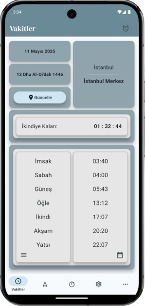
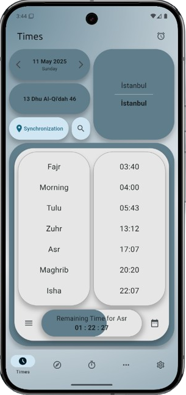

# Namaz Vakti App

Prayer Times App is a comprehensive mobile application developed for all Muslims, displaying prayer times, qibla direction, and many other Islamic features.

## Features

- **Prayer Times:** Shows Fajr, Morning, Tulu, Zuhr, Asr, Maghrib, and Isha times
- **Prayer Compass:** Displays the qibla direction from your location
- **Dhikr Counter:** Helps you keep track of your dhikr and saves records
- **Prayer Notifications:** Notification options for all prayer times
- **Holy Days and Nights:** Tracking of important days in the Islamic calendar
- **Missed Prayers Tracking:** Feature to track your missed prayers
- **Sourcebooks:** Access to Islamic reference book contents
- **Multiple Language Support:** Turkish, English, and other language options
- **Location-Based Information:** Automatic prayer time updates based on your location
- **Dark Mode:** Dark theme option to reduce eye strain
- **Customization:** Theme color, gradient background, and round/sharp corner preferences

## Installation

You can download the app from Google Play Store:

<a href="https://play.google.com/store/apps/details?id=com.afaruk59.namaz_vakti_app&pcampaignid=web_share">
  
</a>

## Development

This application was developed using the Flutter framework. To contribute to development:

```bash
# Clone the repository
git clone https://github.com/afaruk59/Namaz-Vakti-App.git

# Install dependencies
flutter pub get

# Run the application
flutter run
```

## Technologies Used

- Flutter
- Dart
- Provider (State Management)
- Shared Preferences (Local Storage)
- Flutter Compass
- Connectivity Plus (Internet Connection Check)
- Intl and Flutter Localization (Multiple Language Support)
- Permission Handler
- Google Fonts
- Timezone

## License

This project is licensed under Apache License 2.0. For details, check the [LICENSE](LICENSE) file.

## Contact

Developer: [Afaruk59](https://github.com/afaruk59)

## Images

<table border="0">
  <tr>
    <td></td>
    <td></td>
    <td></td>
    <td></td>
    <td></td>
    <td></td>
  </tr>
</table>