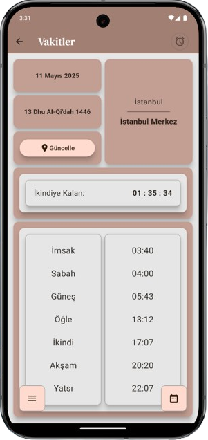

# 🕌 Prayer Times App

[](https://flutter.dev)
[](https://dart.dev)
[](https://developer.android.com)
[](https://opensource.org/licenses/Apache-2.0)

> **A comprehensive prayer times and Islamic features application designed for all Muslims**

## 📱 About the Application

Prayer Times App is a modern and user-friendly mobile application designed to facilitate your daily worship life. It supports your religious life with location-based prayer times, qibla compass, dhikr counter, and many other Islamic features.

## ✨ Features

### 🕐 Prayer Times
- **Automatic Location Detection**: Automatic location detection with GPS
- **All Prayer Time Information**: Fajr, Sunrise, Dhuhr, Asr, Maghrib, Isha, and Tulu times
- **Multi-City Support**: Prayer times for cities in Turkey and around the world
- **Precise Calculation**: Accurate prayer time calculations based on geographical location

### 🧭 Qibla Compass
- **Digital Compass**: Precise digital compass showing the qibla direction
- **Location-Based**: Automatic qibla direction calculation based on your current location
- **Visual Indicator**: Easy-to-use visual interface

### 📿 Dhikr Counter
- **Digital Tasbih**: Touch-based dhikr counting feature
- **Recording System**: Save and track your dhikr counts
- **Multi-Dhikr Support**: Separate counters for different types of dhikr

### 🔔 Prayer Notifications
- **Prayer Time Notifications**: Notification options for all prayer times
- **Customizable**: Choose which prayer times you want to receive notifications for
- **Audio Notifications**: Different notification sound options

### 📅 Religious Days and Nights
- **Islamic Calendar**: Hijri calendar support
- **Special Days**: Tracking of Kandil nights and religious holidays
- **Reminders**: Reminders for important religious days

### 📊 Missed Prayer Tracking
- **Qaza Tracking**: Recording of missed prayers
- **Statistics**: Missed prayer statistics and tracking
- **Motivation**: Goals for completing missed prayers

### 📚 Reference Books
- **Islamic Sources**: Access to religious reference book contents
- **Search Feature**: Ability to search within book contents
- **Categories**: Organized content for different topics

### 🌍 Multi-Language Support
- **Turkish**: Full Turkish language support
- **English**: English language support
- **Arabic**: Arabic language support دعم اللغة العربية
- **Expandable**: Ready infrastructure for more language support

### 🎨 Customization Options
- **Dark Mode**: Dark theme to reduce eye strain
- **Color Options**: Different theme colors
- **Gradient Backgrounds**: Aesthetic gradient background options
- **Corner Shapes**: Round/sharp corner preferences

## 📸 Screenshots

<table>
  <tr>
    <td align="center">
      
    </td>
    <td align="center">
      
    </td>
    <td align="center">
      
    </td>
    <td align="center">
      
    </td>
  </tr>
</table>

## 📲 Download

You can download the app from Google Play Store:

<a href="https://play.google.com/store/apps/details?id=com.afaruk59.namaz_vakti_app&pcampaignid=web_share">
  
</a>

## 🛠️ Technologies

### Core Technologies
- **Flutter**: Cross-platform mobile application framework
- **Dart**: Main programming language
- **Provider**: State management solution

### Used Packages
| Package | Version | Purpose |
|---------|---------|---------|
| `geolocator` | ^13.0.0 | GPS location detection |
| `flutter_compass` | ^0.8.1 | Qibla compass |
| `shared_preferences` | ^2.3.1 | Local data storage |
| `flutter_localization` | ^0.2.2 | Multi-language support |
| `provider` | ^6.1.2 | State management |
| `permission_handler` | ^11.3.1 | Permission management |
| `google_fonts` | ^6.2.1 | Custom fonts |
| `timezone` | ^0.9.4 | Timezone management |
| `hijri` | ^3.0.0 | Hijri calendar |
| `connectivity_plus` | ^6.0.5 | Internet connection check |

## 🚀 Development

### Requirements
- Flutter SDK (>=3.4.4)
- Dart SDK
- Android Studio / VS Code
- Android SDK (for Android development)

### Installation
```bash
# Clone the repository
git clone https://github.com/afaruk59/Namaz-Vakti-App.git

# Navigate to project directory
cd Namaz-Vakti-App

# Install dependencies
flutter pub get

# Run the application
flutter run
```

### Project Structure
```
lib/
├── main.dart                 # Main application file
├── home_page.dart           # Home page
├── components/              # Reusable components
├── pages/                   # Application pages
│   ├── timesPage/          # Prayer times pages
│   ├── qibla.dart          # Qibla compass
│   ├── zikir.dart          # Dhikr counter
│   ├── dates.dart          # Religious days
│   ├── books.dart          # Reference books
│   ├── kaza.dart           # Missed prayer tracking
│   └── settings.dart       # Settings
├── data/                    # Data management
└── l10n/                   # Localization files

assets/
├── img/                     # Image files
├── svg/                     # SVG files
└── cities/                  # City data
```

## 🤝 Contributing

If you want to contribute to the project:

1. Fork this repository
2. Create a new branch (`git checkout -b feature/new-feature`)
3. Commit your changes (`git commit -am 'New feature: Description'`)
4. Push your branch (`git push origin feature/new-feature`)
5. Create a Pull Request

### Development Guidelines
- Follow Dart coding standards when writing code
- Write tests when adding new features
- Write descriptive commit messages
- Keep documentation up to date

## 📄 License

This project is licensed under Apache License 2.0. See [LICENSE](LICENSE) file for details.

```
Copyright 2024-2025 Afaruk59

Licensed under the Apache License, Version 2.0 (the "License");
you may not use this file except in compliance with the License.
You may obtain a copy of the License at

    http://www.apache.org/licenses/LICENSE-2.0

Unless required by applicable law or agreed to in writing, software
distributed under the License is distributed on an "AS IS" BASIS,
WITHOUT WARRANTIES OR CONDITIONS OF ANY KIND, either express or implied.
See the License for the specific language governing permissions and
limitations under the License.
```

## 👨‍💻 Developer

**Afaruk59**
- GitHub: [@afaruk59](https://github.com/afaruk59)
- LinkedIn: [Profile Link](https://linkedin.com/in/afaruk59)

## 📊 Statistics

- **Version**: 1.4.2+28
- **Minimum SDK**: Flutter 3.4.4
- **Supported Platforms**: Android
- **File Size**: ~25MB
- **Languages**: Turkish, English, Arabic

## 🔄 Version History

### v1.4.2 (Latest Version)
- Performance improvements
- New language support added
- Bug fixes
- UI/UX improvements

### Previous Versions
Visit [Releases](https://github.com/afaruk59/Namaz-Vakti-App/releases) page for detailed version history.

## 🆘 Support

For your issues or suggestions:
- GitHub Issues: [Create New Issue](https://github.com/afaruk59/Namaz-Vakti-App/issues)
- Email: [Contact](mailto:afaruk59@gmail.com)

## 🌟 Acknowledgments

Thanks to everyone who contributed to this project. We are grateful to all developers who contributed to the development of the application and users who tested it.

---

<div align="center">
  <strong>🕌 Make your worship life easier with Prayer Times App! 🕌</strong>
</div>
